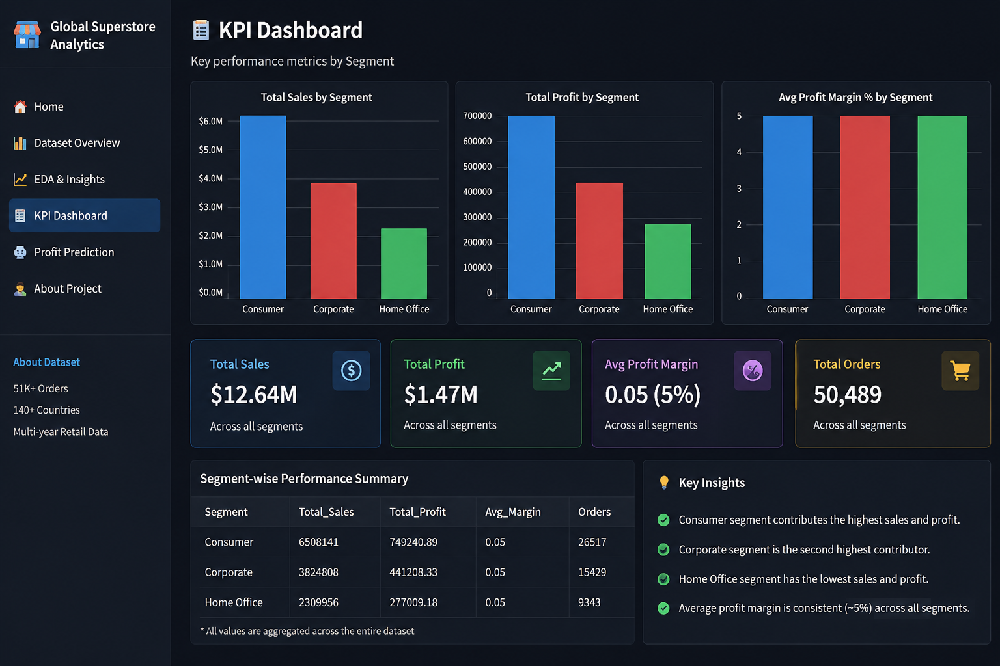
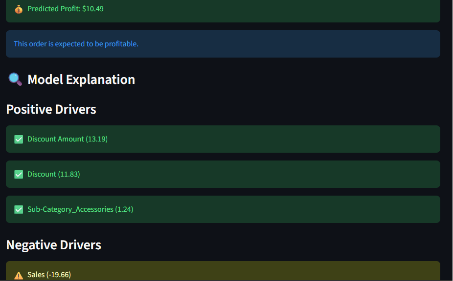
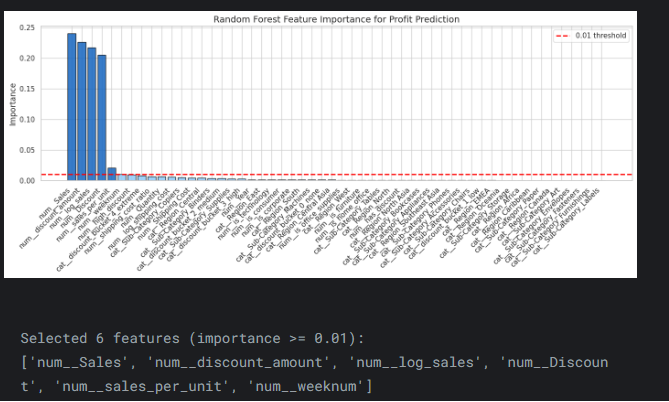
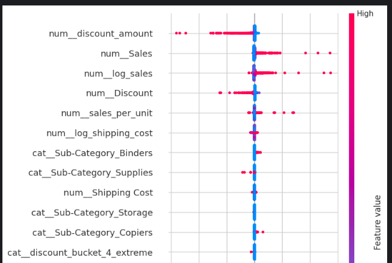
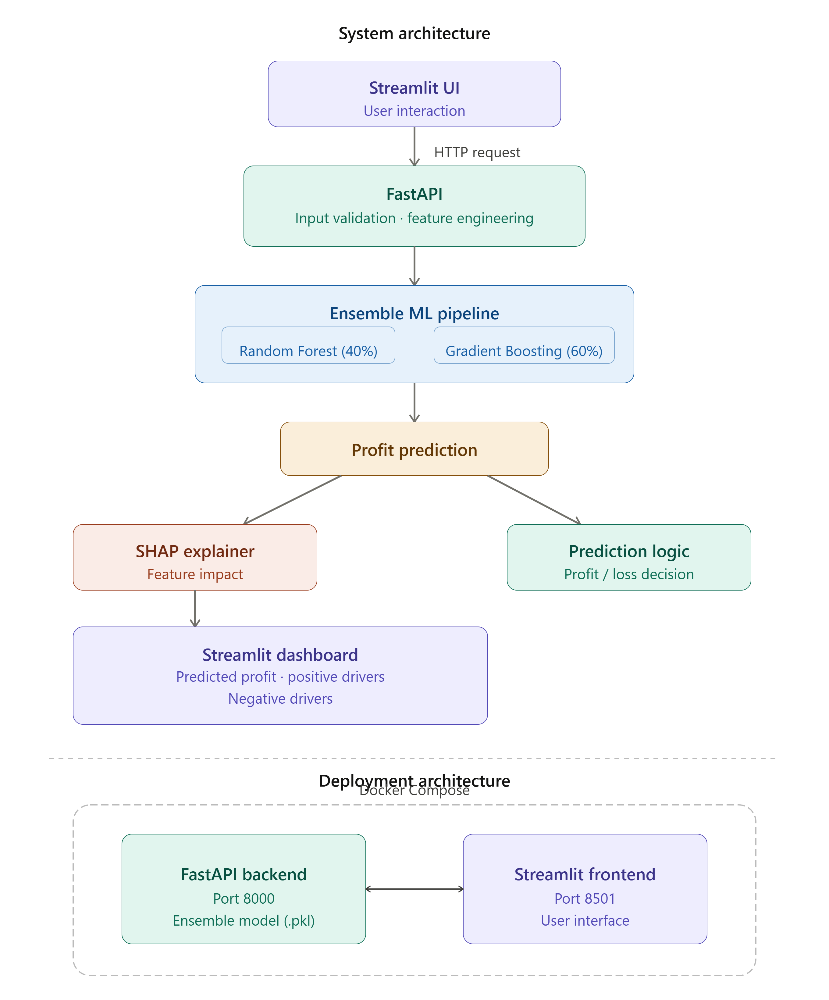

# 🌍 Global Superstore — Profit Prediction

An end-to-end retail analytics and machine learning project that predicts **order-level profit or loss** for a global superstore and explains **why** using SHAP — served through a **FastAPI** backend and an interactive **Streamlit** dashboard.


---

## 📖 Table of Contents

- [Overview](#-overview)
- [Screenshots](#-screenshots)
- [Architecture](#-architecture)
- [Dataset](#-dataset)
- [EDA & Business Insights](#-eda--business-insights)
- [Feature Engineering](#-feature-engineering)
- [Modeling & Results](#-modeling--results)
- [Explainability (SHAP)](#-explainability-shap)
- [Project Structure](#-project-structure)
- [Getting Started](#-getting-started)
- [Running the App](#-running-the-app)
- [API Reference](#-api-reference)
- [Streamlit Dashboard Pages](#-streamlit-dashboard-pages)
- [The Notebook](#-the-notebook)
- [Tech Stack](#-tech-stack)
- [Notes & Roadmap](#-notes--roadmap)
- [Acknowledgments](#-acknowledgments)

---

## 🧭 Overview

Retailers rarely lose money on *every* order — they lose it on a **subset** of orders, usually driven by aggressive discounting, expensive shipping relative to order value, or low‑margin product lines. This project builds a system that:

1. **Explores** 51K+ Global Superstore orders across 140+ countries to find where profit is made and lost.
2. **Tests** five business hypotheses statistically (segment, category, discount, market, shipping method).
3. **Engineers** 20+ business‑relevant features (discount amount, shipping‑cost ratio, sales‑per‑unit, discount buckets, etc.).
4. **Trains and compares** ElasticNet, Random Forest, Gradient Boosting and XGBoost, then combines the two best tree‑based models into a **Voting Regressor ensemble**.
5. **Explains** every single prediction with **SHAP**, surfacing the top features pushing an order toward profit or loss.
6. **Serves** the model through a **FastAPI** REST API and a **Streamlit** dashboard so a non‑technical user can price an order and immediately see why it's expected to win or lose money.

## 🖼 Screenshots

| KPI Dashboard | Prediction + Explanation |
|---|---|
|  |  |

| Random Forest Feature Importance | SHAP Summary Plot |
|---|---|
|  |  |

## 🏗 Architecture



**Request flow:**

1. The **Streamlit UI** collects order details (sales, discount, quantity, shipping cost, category, segment, region, date).
2. It sends them as JSON to the **FastAPI** backend's `/predict` endpoint.
3. FastAPI validates the input (Pydantic), engineers features, and runs them through the **ensemble ML pipeline** (Random Forest 40% + Gradient Boosting 60%, combined via `VotingRegressor`).
4. The pipeline returns a **predicted profit**, and a **SHAP TreeExplainer** built on the Gradient Boosting sub‑model computes the top positive/negative feature drivers.
5. The Streamlit dashboard renders the predicted profit/loss plus a human‑readable explanation of *why*.


## 📊 Dataset

- **Source:** [Enhanced Superstore Sales Dataset](https://www.kaggle.com/datasets/sumeakash/enhanced-superstore-sales-dataset) on Kaggle, downloaded in the notebook via `kagglehub`.
- **Size:** 51,289 orders across 140+ countries, 7 global markets and 13 regions.
- **Key columns:** `Sales`, `Profit`, `Discount`, `Quantity`, `Shipping Cost`, `Category`, `Sub‑Category`, `Segment`, `Region`, `Market`, `Order Date`, `Ship Mode`, and customer/order identifiers.
- **Categories → Sub‑categories** (as enforced by `backend/constants.py`):
  - **Technology** → Accessories, Phones, Copiers, Machines
  - **Furniture** → Tables, Bookcases, Chairs, Furnishings
  - **Office Supplies** → Paper, Art, Storage, Appliances, Supplies, Envelopes, Fasteners, Labels, Binders
- **Segments:** Consumer, Corporate, Home Office
- **Regions:** West, East, South, Central, Africa, Central Asia, North Asia, Caribbean, North, EMEA, Oceania, Southeast Asia, Canada

## 🔍 EDA & Business Insights

Headline numbers from the notebook's final KPI summary:

| Metric | Value |
|---|---|
| Total orders | 51,289 |
| Total revenue | $12,642,905 |
| Total profit | $1,467,458 |
| Overall ROI | 11.6% |
| Loss‑making orders | 12,543 (24.5%) |
| Average discount | 14.3% |
| Most profitable category | Technology ($663,779) |
| Least profitable category | Furniture ($285,205) |
| Best market by profit | APAC |


**Selected business insights:**

- Discounts above ~30% are strongly associated with losses; the notebook suggests **capping discounts around 20%** as a break‑even point for most categories.
- **Tables** and **Bookcases** are structurally loss‑making (high shipping cost + heavy discounting), while **Copiers, Phones and Accessories** drive the strongest margins.
- **APAC** and **EU** are the largest markets by revenue; **Africa** and **EMEA** show the weakest margins.
- Sales grew consistently year‑over‑year, but profit growth lagged due to increasing discount levels (margin compression).

## 🛠 Feature Engineering

Implemented in [`backend/feature_engineering.py`](backend/feature_engineering.py) and mirrored in the training notebook:

| Feature | Formula / Logic | Why it matters |
|---|---|---|
| `discount_amount` | `Sales × Discount` | Absolute monetary cost of discounting |
| `shipping_cost_ratio` | `Shipping Cost / (Sales + 1)` | Flags orders where logistics cost is disproportionate |
| `sales_per_unit` | `Sales / Quantity` | Distinguishes high‑value vs. low‑value products |
| `discount_bucket` | `none / low / medium / high / extreme` based on discount thresholds (0, ≤0.1, ≤0.3, ≤0.5, >0.5) | Non‑linear discount effects |
| `has_discount`, `high_discount` | Binary flags (`> 0`, `> 0.3`) | Simple, interpretable discount signals |
| `log_sales`, `log_shipping_cost` | `log1p(x)` | Compresses right‑skewed monetary values |
| `is_technology`, `is_furniture`, `is_office_supplies` | One‑hot flags on `Category` | Category‑level effects |
| `is_consumer`, `is_corporate`, `is_home_office` | One‑hot flags on `Segment` | Segment‑level effects |

These, plus the raw numeric/categorical inputs and the order's `Year`/ISO `weeknum`, are passed through the pipeline's `ColumnTransformer` (one‑hot encoding for categoricals, numeric passthrough), producing **54 model‑ready features**.

## 🤖 Modeling & Results

Five regression approaches were compared on a held‑out test split (see the notebook, section 14–15):

| Model | MAE ($) | RMSE ($) | R² |
|---|---|---|---|
| ElasticNet | 41.37 | 97.40 | 0.688 |
| XGBoost | 34.68 | 89.72 | 0.735 |
| Random Forest | 35.48 | 85.52 | 0.759 |
| Gradient Boosting | 35.81 | 84.65 | 0.764 |
| **Ensemble (RF 40% + GB 60%)** ✅ | **35.51** | **83.96** | **0.768** |

The final model shipped in [`backend/models/ensemble_pipeline.pkl`](backend/models/ensemble_pipeline.pkl) is a `sklearn.Pipeline` containing:

1. A `ColumnTransformer` **preprocessor** (encodes categoricals, passes through engineered numeric features).
2. A `VotingRegressor` **ensemble** of:
   - `RandomForestRegressor` (200 trees, max depth 7)
   - `GradientBoostingRegressor` (450 estimators, learning rate 0.03, max depth 3, subsample 0.8)
   - combined with weights `[0.4, 0.6]` in favor of Gradient Boosting.

Residual analysis in the notebook shows residuals centered near zero with no strong systematic pattern, and a train/test R² gap small enough to indicate limited overfitting.

## 🔎 Explainability (SHAP)

Rather than explaining the full voting ensemble (expensive/awkward for SHAP), the API builds a `shap.TreeExplainer` on the **Gradient Boosting sub‑model** inside the `VotingRegressor` — the dominant, tree‑based component — making explanations both fast and faithful to the ensemble's main driver.

For every prediction, [`backend/main.py`](backend/main.py) computes SHAP values, maps internal feature names to readable labels (e.g. `log_sales` → *"Sales (Log Scale)"*, `Region_West` → *"Region: West"*), and returns the **top 3 positive** and **top 3 negative** drivers.

Across the dataset, the strongest global drivers of predicted profit are consistently: **discount amount, sales, log‑sales, discount rate,** and **sales‑per‑unit** — matching the hypothesis‑testing results above.

## 📁 Project Structure

```
profit-prediction/
├── backend/
│   ├── __init__.py
│   ├── constants.py            # Allowed categories, sub-categories, segments & regions
│   ├── feature_engineering.py  # feature_extraction() — builds engineered features from a raw order
│   ├── main.py                 # FastAPI app: /, /health, /predict — prediction + SHAP explanation
│   ├── models/
│   │   └── ensemble_pipeline.pkl  # Trained sklearn Pipeline (preprocessing + Voting ensemble)
│   └── schema.py                # Pydantic request/response models & validation rules
├── notebooks/
│   └── loss_and_profit_in_sales_global_market.ipynb  # Full EDA → hypothesis testing → modeling → SHAP
├── streamlit_app/
│   ├── Images/                  # Screenshots & diagrams (used by the dashboard and this README)
│   └── app.py                   # Multi-page Streamlit dashboard + prediction UI
├── requirements.txt
└── .gitignore
```

## ⚙ Getting Started

### Prerequisites

- **Python 3.11+** (the pinned dependency versions — pandas 3.x, numpy 2.4.x, scikit‑learn 1.7.x — are recent, so an up‑to‑date interpreter is recommended)
- `pip`
- Optionally, a virtual environment tool (`venv`, `conda`, etc.)

### Installation

```bash
git clone https://github.com/Nikhil-evol/profit-prediction.git
cd profit-prediction

python -m venv venv
source venv/bin/activate      # On Windows: venv\Scripts\activate

pip install -r requirements.txt
```

> ⚠ The shipped `ensemble_pipeline.pkl` was trained with the exact scikit‑learn/joblib versions pinned in `requirements.txt`. Using different versions can trigger `InconsistentVersionWarning` or subtly different predictions — stick to the pinned versions for reproducible results.

## 🚀 Running the App

### 1. Start the FastAPI backend

Run this **from the project root** so the package‑relative imports inside `backend/main.py` resolve correctly:

```bash
uvicorn backend.main:app --reload --host 0.0.0.0 --port 8000
```

- Interactive API docs: **http://localhost:8000/docs**
- Health check: **http://localhost:8000/health**

### 2. Start the Streamlit frontend

In a second terminal, point the app at your local backend and launch it:

```bash
# macOS / Linux
export API_URL=http://localhost:8000
streamlit run streamlit_app/app.py

# Windows (PowerShell)
$env:API_URL="http://localhost:8000"
streamlit run streamlit_app/app.py
```

Then open **http://localhost:8501**.

If `API_URL` is not set, the app defaults to a hosted demo backend on Render. That free‑tier service sleeps after inactivity, so the "Profit Prediction" page automatically polls `/health` (up to ~3 minutes) to wake it before submitting a prediction.

## 📡 API Reference

| Method | Path | Description |
|---|---|---|
| `GET` | `/` | Basic project/status payload |
| `GET` | `/health` | Health check |
| `POST` | `/predict` | Predict profit for one order + SHAP explanation |

### Request body (`POST /predict`)

| Field | Type | Constraints |
|---|---|---|
| `sales` | float | `> 0` |
| `discount` | float | `0.0 – 1.0` |
| `quantity` | int | `> 0` |
| `shipping_cost` | float | `>= 0` |
| `category` | string | `Technology`, `Furniture`, `Office Supplies` |
| `segment` | string | `Consumer`, `Corporate`, `Home Office` |
| `sub_category` | string | Must belong to the chosen `category` (see `constants.py`) |
| `region` | string | One of 13 supported regions |
| `order_date` | date (`YYYY-MM-DD`) | Year between 2010 and 2030 |

### Example request

```bash
curl -X POST http://localhost:8000/predict \
  -H "Content-Type: application/json" \
  -d '{
        "sales": 500.0,
        "discount": 0.2,
        "quantity": 3,
        "shipping_cost": 14.5,
        "category": "Technology",
        "segment": "Consumer",
        "sub_category": "Phones",
        "region": "West",
        "order_date": "2026-06-15"
      }'
```

### Example response

*(captured by actually running the shipped `ensemble_pipeline.pkl` against the request above)*

```json
{
  "predicted_profit": 36.6821,
  "status": "Profit",
  "message": "This order is expected to be profitable.",
  "shap_explanation": {
    "positive_drivers": [
      { "feature": "Sales (Log Scale)", "shap_value": 24.2037 },
      { "feature": "Sales", "shap_value": 21.4955 },
      { "feature": "Discount", "shap_value": 18.5604 }
    ],
    "negative_drivers": [
      { "feature": "Discount Amount", "shap_value": -56.6799 },
      { "feature": "log_shipping_cost", "shap_value": -1.4879 },
      { "feature": "sales_per_unit", "shap_value": -0.984 }
    ]
  }
}
```

## 🖥 Streamlit Dashboard Pages

| Page | What it shows |
|---|---|
| **Home** | Project highlights and headline KPIs |
| **Dataset Overview** | Summary of the Global Superstore dataset |
| **EDA & Insights** | Feature importance & SHAP summary charts, key takeaways |
| **KPI Dashboard** | Revenue, profit, ROI and loss‑rate metrics |
| **Profit Prediction** | Interactive form → calls the FastAPI `/predict` endpoint and displays predicted profit/loss with positive/negative SHAP drivers in plain language |
| **About** | Full project write‑up: dataset, hypotheses, modeling approach, and business insights |

## 📓 The Notebook

[`notebooks/loss_and_profit_in_sales_global_market.ipynb`](notebooks/loss_and_profit_in_sales_global_market.ipynb) contains the complete, reproducible analysis behind this project, organized into 16 sections:

Setup & data loading → Cleaning & preprocessing → Feature engineering → Univariate analysis → Sales & profit analysis → Category/sub‑category analysis → Market & regional analysis → Discount impact analysis → Time series analysis → Shipping analysis → Correlation analysis → Statistical hypothesis testing → Feature selection → 5 ML models → Model comparison & ensembling → Key insights & business report.

To run it yourself, install the extra libraries it uses beyond `requirements.txt` (needed only for the notebook, not for serving):

```bash
pip install jupyter xgboost matplotlib seaborn scipy kagglehub
```

`kagglehub` downloads the dataset directly from Kaggle and may require Kaggle API credentials (`~/.kaggle/kaggle.json`) the first time it runs.

## 🛠 Tech Stack

- **Language:** Python
- **Data & ML:** Pandas, NumPy, Scikit‑learn, XGBoost (notebook comparison), SHAP
- **Backend:** FastAPI, Uvicorn, Pydantic
- **Frontend:** Streamlit, Requests
- **Model serialization:** Joblib
- **Notebook/EDA:** Jupyter, Matplotlib, Seaborn, SciPy


## 🙏 Acknowledgments

- Dataset: [Enhanced Superstore Sales Dataset](https://www.kaggle.com/datasets/sumeakash/enhanced-superstore-sales-dataset) on Kaggle.
- Built with FastAPI, Streamlit, scikit‑learn and SHAP.